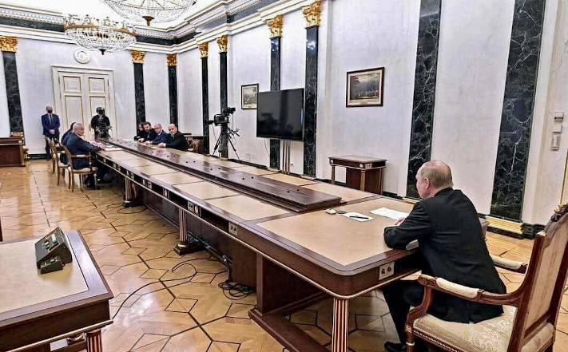

# Samizdat

Ce site sur les fausses informations fait partie d'un projet visant à générer du contenu statique à partir de fichiers markdown.
L'objectif est d'ajouter des vidéos extraites, de tout mettre sur une image disque et de la partager via bittorrent.
Considérez cela comme un <a href="https://fr.wikipedia.org/wiki/Samizdat" target="_blank">samizdat</a> moderne.

[Inscrivez-vous](account/register/), explorez le [projet](https://fakemedium.com/project/), jetez un œil aux [visiteurs](/matomo/),
ou découvrez comment vous pouvez [contribuer](contribute/).